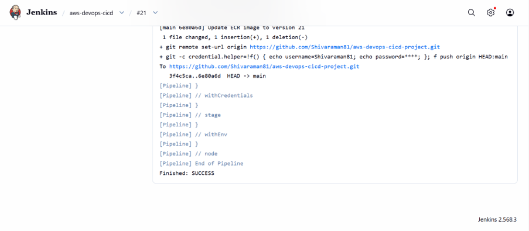
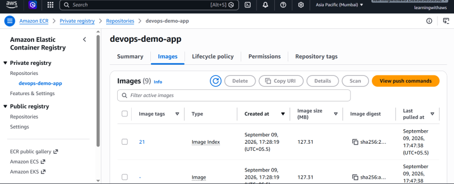
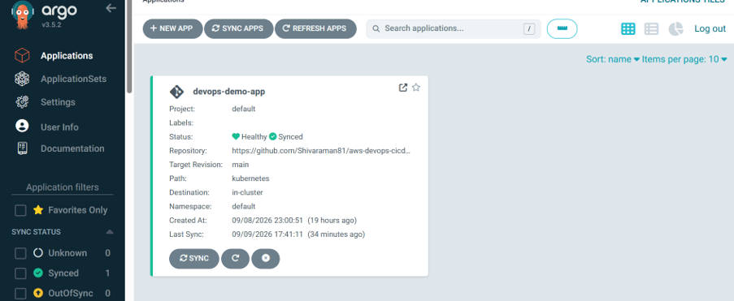
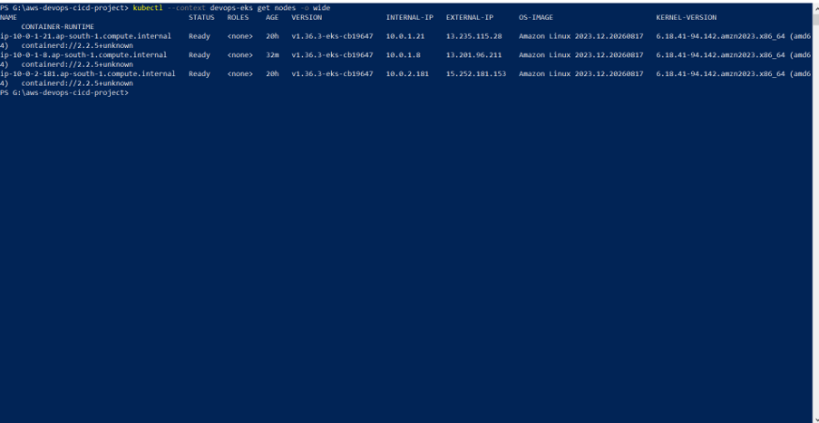
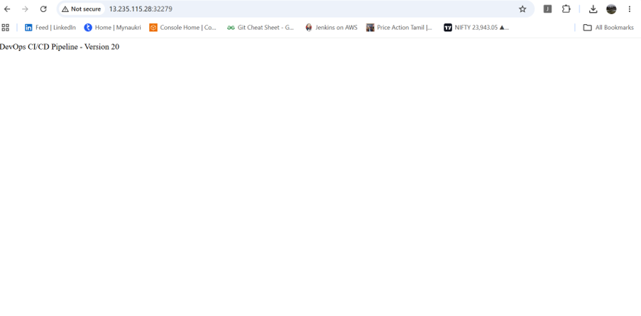

# AWS DevOps CI/CD Pipeline with Jenkins, Docker, Kubernetes, Terraform & Argo CD

## Overview

This project demonstrates an end-to-end AWS DevOps CI/CD and GitOps workflow for deploying a Java Spring Boot application to Amazon EKS.

The pipeline automates application build, testing, Docker image creation, image publishing to Amazon ECR, Kubernetes deployment through GitOps, and application monitoring.

## Architecture

GitHub → Jenkins → Maven → Docker → Amazon ECR → GitHub Kubernetes Manifest → Argo CD → Amazon EKS

## Technologies

- AWS
- Amazon EKS
- Amazon ECR
- Jenkins
- Docker
- Kubernetes
- Terraform
- Argo CD
- Maven
- Prometheus
- Grafana
- GitHub

## Project Structure

```text
aws-devops-cicd-project/
├── app/
│   └── Spring Boot application
├── kubernetes/
│   └── Kubernetes deployment and service manifests
├── argocd/
│   └── Argo CD GitOps configuration
├── terraform/
│   └── AWS infrastructure configuration
└── .gitignore

## Pipeline Evidence

### Jenkins Build #21


### Amazon ECR Image


### Argo CD


### Amazon EKS


### Live Application

